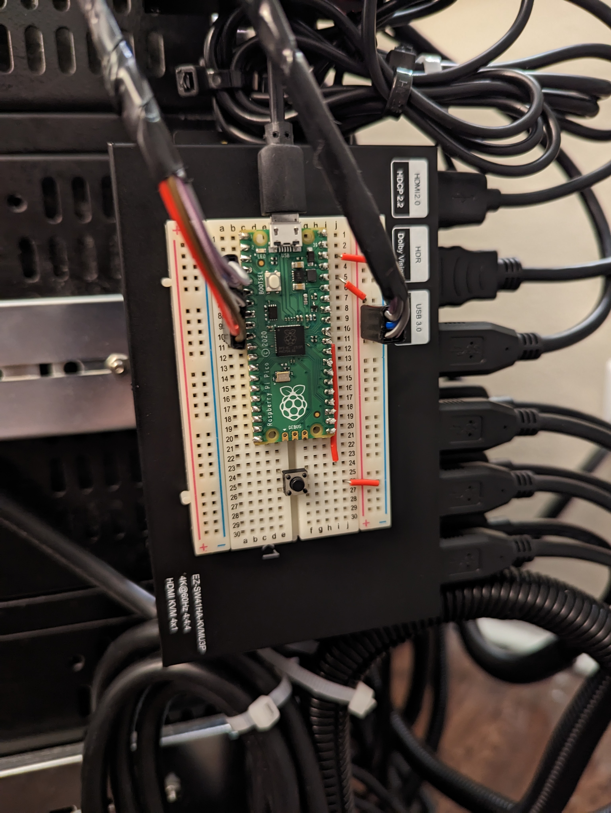
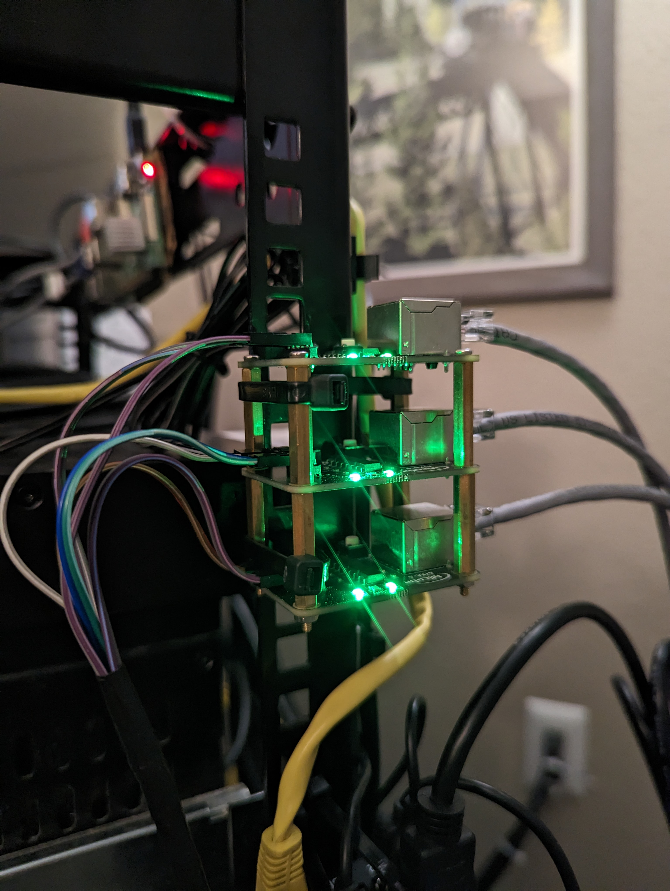

# pikvm-atx

This project was created from the [rp2040-project-template](https://github.com/rp-rs/rp2040-project-template) project.

This project allows for the control of multiple ATX power commands from a single PiKVM unit.
The Raspberry Pi Pico microcontroller is used to create a serial over USB port on the host PiKVM unit. PiKVM unit can send byte arrays to tell the pico which computer's ATX command to execute, and for how long.

Currently only supports 4 servers to match the 4 outputs of the Ezcoo swtich. The GPIO pins are specified [here](https://github.com/ProjectInitiative/pikvm-atx/blob/11c8ea064bed4efc8f3fb10e5a9a07164d9d5eaf/src/main.rs#L103)

Adding plugin and web UI support to the PiKVM project is currently in progress. The `send-atx-command.py` script is provided to achieve the comms. Copy the script to the PiKVM unit and install pyserial `pacman -Sy python3-pyserial`

<!-- TABLE OF CONTENTS -->
<details open="open">
  
  <summary><h2 style="display: inline-block">Table of Contents</h2></summary>
  <ol>
    <li><a href="#markdown-header-requirements">Requirements</a></li>
    <li><a href="#BOM">Bill Of Materials</a></li>
    <li><a href="#installation-of-development-dependencies">Installation of development dependencies</a></li>
    <li><a href="#running">Running</a></li>
    <li><a href="#alternative-runners">Alternative runners</a></li>
    <li><a href="#contributing">Contributing</a></li>
    <li><a href="#code-of-conduct">Code of conduct</a></li>
  </ol>
</details>

<!-- Requirements -->
<details open="open">
  <summary><h2 style="display: inline-block" id="requirements">Requirements</h2></summary>
  
- The standard Rust tooling (cargo, rustup) which you can install from https://rustup.rs/

- Toolchain support for the cortex-m0+ processors in the rp2040 (thumbv6m-none-eabi)

- flip-link - this allows you to detect stack-overflows on the first core, which is the only supported target for now.

- probe-run. Upstream support for RP2040 was added with version 0.3.1.

- A CMSIS-DAP probe. (J-Link and other probes will not work with probe-run)

  You can use a second
  [Pico as a CMSIS-DAP debug probe](debug_probes.md#raspberry-pi-pico). Details
  on other supported debug probes can be found in
  [debug_probes.md](debug_probes.md)

</details>

<!-- BOM -->
<details open="open">
  <summary><h2 style="display: inline-block" id="BOM">Bill Of Materials</h2></summary>

  * [Raspberry Pi Pico](https://www.amazon.com/dp/B08X7HN2VG)
  * [Breadboard and wires](https://www.amazon.com/dp/B07KGQHJW8)
  * [ATX Adapter Board](https://www.aliexpress.us/item/3256803575136141.html)
  * (optional, can use other switches)[Ezcoo KVM Switch](https://www.amazon.com/dp/B082D7YJH6/)




<!-- Installation of development dependencies -->
<details open="open">
  <summary><h2 style="display: inline-block" id="installation-of-development-dependencies">Installation of development dependencies</h2></summary>

```sh
rustup target install thumbv6m-none-eabi
cargo install flip-link
# This is our suggested default 'runner'
cargo install probe-run
# If you want to use elf2uf2-rs instead of probe-run, instead do...
cargo install elf2uf2-rs --locked
```

</details>


<!-- Running -->
<details open="open">
  <summary><h2 style="display: inline-block" id="running">Running</h2></summary>
  
For a debug build
```sh
cargo run
```
For a release build
```sh
cargo run --release
```

If you do not specify a DEFMT_LOG level, it will be set to `debug`.
That means `println!("")`, `info!("")` and `debug!("")` statements will be printed.
If you wish to override this, you can change it in `.cargo/config.toml` 
```toml
[env]
DEFMT_LOG = "off"
```
You can also set this inline (on Linux/MacOS)  
```sh
DEFMT_LOG=trace cargo run
```

or set the _environment variable_ so that it applies to every `cargo run` call that follows:
#### Linux/MacOS/unix
```sh
export DEFMT_LOG=trace
```

Setting the DEFMT_LOG level for the current session  
for bash
```sh
export DEFMT_LOG=trace
```

#### Windows
Windows users can only override DEFMT_LOG through `config.toml`
or by setting the environment variable as a separate step before calling `cargo run`
- cmd
```cmd
set DEFMT_LOG=trace
```
- powershell
```ps1
$Env:DEFMT_LOG = trace
```

```cmd
cargo run
```

</details>
<!-- ALTERNATIVE RUNNERS -->
<details open="open">
  <summary><h2 style="display: inline-block" id="alternative-runners">Alternative runners</h2></summary>

If you don't have a debug probe or if you want to do interactive debugging you can set up an alternative runner for cargo.  

Some of the options for your `runner` are listed below:

* **cargo embed**  
  *Step 1* - Install [`cargo embed`](https://github.com/probe-rs/cargo-embed):

  ```console
  $ cargo install cargo-embed
  ```

  *Step 2* - Make sure your .cargo/config contains the following

  ```toml
  [target.thumbv6m-none-eabi]
  runner = "cargo embed"
  ```

  *Step 3* - Update settings in [Embed.toml](./Embed.toml)  
  - The defaults are to flash, reset, and start a defmt logging session
  You can find all the settings and their meanings [in the cargo-embed repo](https://github.com/probe-rs/cargo-embed/blob/master/src/config/default.toml)

  *Step 4* - Use `cargo run`, which will compile the code and start the
  specified 'runner'. As the 'runner' is cargo embed, it will flash the device
  and start running immediately

  ```console
  $ cargo run --release
  ```

* **probe-rs-debugger**

  *Step 1* - Download [`probe-rs-debugger VSCode plugin 0.4.0`](https://github.com/probe-rs/vscode/releases/download/v0.4.0/probe-rs-debugger-0.4.0.vsix)

  *Step 2* - Install `probe-rs-debugger VSCode plugin`
  ```console
  $ code --install-extension probe-rs-debugger-0.4.0.vsix
  ```

  *Step 3* - Install `probe-rs-debugger`
  ```console
  $ cargo install probe-rs-debugger
  ```

  *Step 4* - Open this project in VSCode

  *Step 5* - Launch a debug session by choosing `Run`>`Start Debugging` (or press F5)

* **Loading a UF2 over USB**  
  *Step 1* - Install [`elf2uf2-rs`](https://github.com/JoNil/elf2uf2-rs):

  ```console
  $ cargo install elf2uf2-rs --locked
  ```

  *Step 2* - Make sure your .cargo/config contains the following

  ```toml
  [target.thumbv6m-none-eabi]
  runner = "elf2uf2-rs -d"
  ```

  The `thumbv6m-none-eabi` target may be replaced by the all-Arm wildcard
  `'cfg(all(target_arch = "arm", target_os = "none"))'`.

  *Step 3* - Boot your RP2040 into "USB Bootloader mode", typically by rebooting
  whilst holding some kind of "Boot Select" button. On Linux, you will also need
  to 'mount' the device, like you would a USB Thumb Drive.

  *Step 4* - Use `cargo run`, which will compile the code and start the
  specified 'runner'. As the 'runner' is the elf2uf2-rs tool, it will build a UF2
  file and copy it to your RP2040.

  ```console
  $ cargo run --release
  ```

* **Loading with picotool**  
  As ELF files produced by compiling Rust code are completely compatible with ELF
  files produced by compiling C or C++ code, you can also use the Raspberry Pi
  tool [picotool](https://github.com/raspberrypi/picotool). The only thing to be
  aware of is that picotool expects your ELF files to have a `.elf` extension, and
  by default Rust does not give the ELF files any extension. You can fix this by
  simply renaming the file.

  This means you can't easily use it as a cargo runner - yet.

  Also of note is that the special
  [pico-sdk](https://github.com/raspberrypi/pico-sdk) macros which hide
  information in the ELF file in a way that `picotool info` can read it out, are
  not supported in Rust. An alternative is TBC.

</details>


## Code of Conduct

Contribution to this crate is organized under the terms of the [Rust Code of
Conduct][CoC], and the maintainer of this crate, the [rp-rs team], promises
to intervene to uphold that code of conduct.

[CoC]: CODE_OF_CONDUCT.md
[rp-rs team]: https://github.com/orgs/rp-rs/teams/rp-rs

